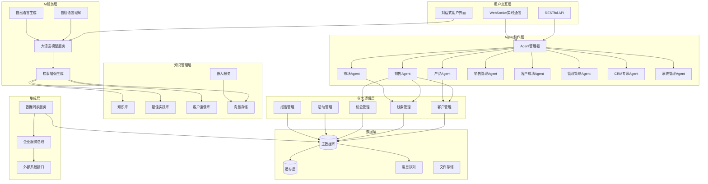
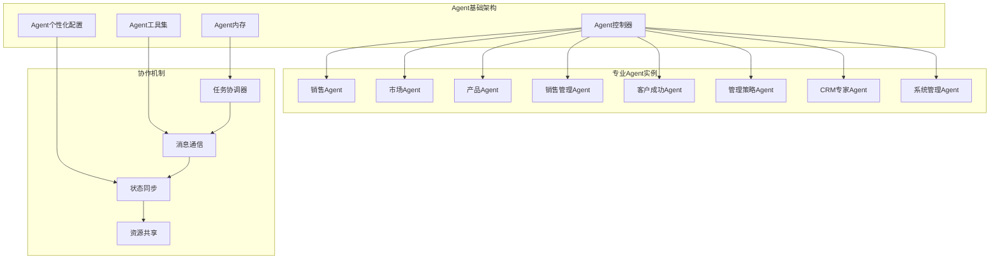
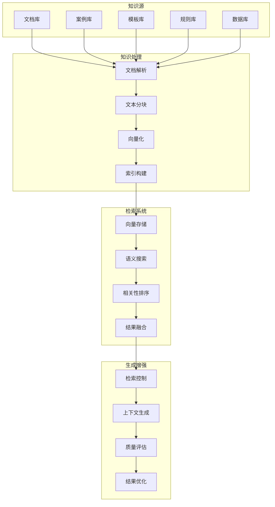

# 设计文档

## 概述

对话式智能CRM系统采用现代AI架构，将大语言模型(LLM)、检索增强生成(RAG)技术和多Agent协作系统深度集成，构建一个智能化的客户关系管理平台。系统通过自然语言交互界面，为用户提供全生命周期的CRM智能化服务，实现从客户发现到客户成功的端到端智能化管理。

### 核心设计理念

1. **对话优先**: 所有功能都通过自然语言交互实现，降低学习成本
2. **AI原生**: 深度集成LLM和RAG技术，提供智能化的决策支持
3. **Agent协作**: 通过专业化Agent系统实现复杂业务场景的智能处理
4. **知识驱动**: 基于组织知识库和最佳实践提供个性化建议
5. **持续学习**: 系统能够从用户交互中学习并持续优化

## 架构设计

### 整体架构



### 核心组件设计

#### 1. 对话式交互层

**自然语言处理引擎**
- 基于Transformer架构的LLM模型
- 支持多轮对话上下文管理
- 意图识别和实体抽取
- 情感分析和语义理解

**对话管理器**
- 对话状态跟踪
- 上下文维护和传递
- 多Agent对话协调
- 会话持久化

#### 2. 多Agent协作系统

**Agent架构设计**



**Agent专业化设计**

1. **销售Agent**
   - 专业领域：销售流程、客户关系、谈判技巧
   - 核心能力：客户开发、机会推进、成交管理
   - 知识库：销售方法论、成功案例、话术模板

2. **市场Agent**
   - 专业领域：市场分析、线索管理、营销策略
   - 核心能力：线索评估、市场洞察、竞争分析
   - 知识库：行业报告、市场趋势、营销最佳实践

3. **产品Agent**
   - 专业领域：产品知识、技术方案、实施交付
   - 核心能力：方案匹配、技术支持、实施规划
   - 知识库：产品文档、技术规范、实施案例

4. **销售管理Agent**
   - 专业领域：团队管理、绩效分析、资源配置
   - 核心能力：团队优化、目标管理、流程改进
   - 知识库：管理理论、绩效模型、团队最佳实践

5. **客户成功Agent**
   - 专业领域：客户满意度、续约管理、价值实现
   - 核心能力：健康度监控、续约策略、价值挖掘
   - 知识库：客户成功方法论、续约案例、价值证明

6. **管理策略Agent**
   - 专业领域：战略分析、业务洞察、决策支持
   - 核心能力：数据分析、趋势预测、战略建议
   - 知识库：商业分析、战略框架、决策模型

7. **CRM专家Agent**
   - 专业领域：CRM最佳实践、流程优化、知识管理
   - 核心能力：流程指导、知识整合、质量控制
   - 知识库：CRM理论、行业标准、实施经验

8. **系统管理Agent**
   - 专业领域：系统运维、安全管理、集成配置
   - 核心能力：系统监控、安全防护、集成管理
   - 知识库：技术文档、安全规范、运维经验

#### 3. RAG知识增强系统

**知识库架构**



**知识库分类**

1. **CRM知识库**
   - 销售方法论和流程
   - 客户管理最佳实践
   - 行业解决方案
   - 产品技术文档

2. **最佳实践库**
   - 成功案例集合
   - 话术模板库
   - 流程标准化文档
   - 经验总结

3. **客户画像库**
   - 客户基础信息
   - 行为数据分析
   - 偏好和需求模型
   - 关系网络图谱

4. **业务规则库**
   - 销售流程规则
   - 评分算法规则
   - 分配策略规则
   - 预警触发规则

#### 4. 业务逻辑层设计

**核心业务模块**

```mermaid
graph TB
    subgraph "客户管理模块"
        CM[客户信息管理]
        CR[客户关系管理]
        CP[客户画像分析]
        CI[客户互动记录]
    end
    
    subgraph "线索管理模块"
        LG[线索生成]
        LS[线索评分]
        LA[线索分配]
        LT[线索跟踪]
    end
    
    subgraph "机会管理模块"
        OC[机会创建]
        OS[阶段管理]
        OF[漏斗分析]
        OP[预测分析]
    end
    
    subgraph "活动管理模块"
        AT[任务管理]
        AS[日程安排]
        AR[提醒通知]
        AF[跟进管理]
    end
    
    subgraph "分析报告模块"
        RA[业绩分析]
        RT[趋势分析]
        RP[预测报告]
        RD[仪表板]
    end
    
    CM --> CR
    CR --> CP
    CP --> CI
    
    LG --> LS
    LS --> LA
    LA --> LT
    
    OC --> OS
    OS --> OF
    OF --> OP
    
    AT --> AS
    AS --> AR
    AR --> AF
    
    RA --> RT
    RT --> RP
    RP --> RD
```



## 组件和接口设计

### 1. Agent接口设计

**基础Agent接口**

```python
from abc import ABC, abstractmethod
from typing import List, Dict, Any, Optional
from pydantic import BaseModel

class BaseAgent(ABC):
    """基础Agent抽象类"""
    
    def __init__(self, agent_id: str, name: str, specialty: str):
        self.id = agent_id
        self.name = name
        self.specialty = specialty
        self.capabilities: List[str] = []
    
    @abstractmethod
    async def process_message(self, message: Message, context: Context) -> AgentResponse:
        """处理消息的核心方法"""
        pass
    
    @abstractmethod
    async def collaborate(self, agents: List['BaseAgent'], task: Task) -> CollaborationResult:
        """与其他Agent协作"""
        pass
    
    async def update_knowledge(self, knowledge: Knowledge) -> None:
        """更新知识库"""
        pass
    
    def get_state(self) -> AgentState:
        """获取Agent状态"""
        pass
    
    def set_state(self, state: AgentState) -> None:
        """设置Agent状态"""
        pass

interface AgentResponse {
  content: string;
  confidence: number;
  suggestions: Suggestion[];
  nextActions: Action[];
  collaborationNeeded?: CollaborationRequest;
}

interface CollaborationRequest {
  requiredAgents: string[];
  task: string;
  priority: number;
  deadline?: Date;
}
```

**专业Agent接口扩展**

```python
class SalesAgent(BaseAgent):
    """销售专业Agent"""
    
    async def analyze_customer(self, customer_id: str) -> CustomerAnalysis:
        """分析客户信息"""
        pass
    
    async def generate_talking_points(self, context: SalesContext) -> List[TalkingPoint]:
        """生成销售话术"""
        pass
    
    async def assess_opportunity(self, opportunity_id: str) -> OpportunityAssessment:
        """评估销售机会"""
        pass
    
    async def recommend_next_action(self, context: SalesContext) -> ActionRecommendation:
        """推荐下一步行动"""
        pass

class MarketAgent(BaseAgent):
    """市场专业Agent"""
    
    async def score_lead(self, lead: Lead) -> LeadScore:
        """线索评分"""
        pass
    
    async def analyze_market_trend(self, industry: str) -> MarketTrend:
        """分析市场趋势"""
        pass
    
    async def generate_competitive_analysis(self, competitor: str) -> CompetitiveAnalysis:
        """生成竞争分析"""
        pass
    
    async def recommend_marketing_strategy(self, target: Target) -> MarketingStrategy:
        """推荐营销策略"""
        pass

class ProductAgent(BaseAgent):
    """产品专业Agent"""
    
    async def match_solution(self, requirements: List[str]) -> SolutionMatch:
        """匹配产品方案"""
        pass
    
    async def generate_technical_proposal(self, context: TechnicalContext) -> TechnicalProposal:
        """生成技术方案"""
        pass

class CustomerSuccessAgent(BaseAgent):
    """客户成功Agent"""
    
    async def monitor_health_score(self, customer_id: str) -> HealthScore:
        """监控客户健康度"""
        pass
    
    async def identify_expansion_opportunities(self, customer_id: str) -> List[ExpansionOpportunity]:
        """识别扩展机会"""
        pass

class ManagementStrategyAgent(BaseAgent):
    """管理策略Agent"""
    
    async def analyze_business_performance(self, metrics: Dict[str, Any]) -> BusinessAnalysis:
        """分析业务表现"""
        pass
    
    async def predict_sales_forecast(self, historical_data: List[Dict]) -> SalesForecast:
        """预测销售业绩"""
        pass

class CRMExpertAgent(BaseAgent):
    """CRM专家Agent"""
    
    async def provide_best_practices(self, scenario: str) -> List[BestPractice]:
        """提供最佳实践建议"""
        pass
    
    async def optimize_workflow(self, current_process: WorkflowProcess) -> OptimizedWorkflow:
        """优化工作流程"""
        pass

class SystemManagementAgent(BaseAgent):
    """系统管理Agent"""
    
    async def monitor_system_health(self) -> SystemHealthReport:
        """监控系统健康状态"""
        pass
    
    async def manage_integrations(self, integration_config: IntegrationConfig) -> IntegrationResult:
        """管理系统集成"""
        pass
```

### 2. RAG系统接口

**知识检索接口**

```python
from typing import List, Optional
import numpy as np

class RAGService:
    """检索增强生成服务"""
    
    async def search(self, query: str, filters: Optional[List[SearchFilter]] = None) -> List[SearchResult]:
        """基础搜索方法"""
        pass
    
    async def semantic_search(self, embedding: np.ndarray, top_k: int = 10) -> List[Document]:
        """语义搜索"""
        pass
    
    async def hybrid_search(self, query: str, embedding: np.ndarray) -> List[SearchResult]:
        """混合检索(向量+关键词)"""
        pass
    
    async def add_document(self, document: Document) -> str:
        """添加文档到知识库"""
        pass
    
    async def update_document(self, doc_id: str, document: Document) -> None:
        """更新文档"""
        pass
    
    async def delete_document(self, doc_id: str) -> None:
        """删除文档"""
        pass
    
    async def generate_embedding(self, text: str) -> np.ndarray:
        """生成文本嵌入向量"""
        pass
    
    async def batch_generate_embeddings(self, texts: List[str]) -> List[np.ndarray]:
        """批量生成嵌入向量"""
        pass

interface SearchResult {
  document: Document;
  score: number;
  relevance: number;
  snippet: string;
}

interface Document {
  id: string;
  title: string;
  content: string;
  metadata: Record<string, any>;
  embedding?: number[];
  tags: string[];
  category: string;
  createdAt: Date;
  updatedAt: Date;
}
```

### 3. 对话管理接口

**对话服务接口**

```python
class ConversationService:
    """对话管理服务"""
    
    async def start_conversation(self, user_id: str, context: Optional[Context] = None) -> Conversation:
        """开始新对话"""
        pass
    
    async def continue_conversation(self, conversation_id: str, message: str) -> ConversationResponse:
        """继续对话"""
        pass
    
    async def end_conversation(self, conversation_id: str) -> None:
        """结束对话"""
        pass
    
    async def get_context(self, conversation_id: str) -> Context:
        """获取对话上下文"""
        pass
    
    async def update_context(self, conversation_id: str, context: Context) -> None:
        """更新对话上下文"""
        pass
    
    async def get_history(self, conversation_id: str) -> List[Message]:
        """获取对话历史"""
        pass
    
    async def search_history(self, user_id: str, query: str) -> List[Message]:
        """搜索对话历史"""
        pass

interface ConversationResponse {
  message: string;
  suggestions: string[];
  actions: Action[];
  agentInfo: AgentInfo;
  confidence: number;
}

interface Context {
  userId: string;
  userRole: string;
  currentTask?: string;
  businessContext: Record<string, any>;
  conversationHistory: Message[];
  activeAgents: string[];
}
```

## 数据模型设计

### 1. 核心业务实体

**客户实体模型**

```python
from pydantic import BaseModel
from typing import List, Dict, Any, Optional
from datetime import datetime
from enum import Enum

class CompanySize(str, Enum):
    STARTUP = "startup"
    SMALL = "small"
    MEDIUM = "medium"
    LARGE = "large"
    ENTERPRISE = "enterprise"

class CustomerStatus(str, Enum):
    PROSPECT = "prospect"
    QUALIFIED = "qualified"
    CUSTOMER = "customer"
    INACTIVE = "inactive"

class CustomerProfile(BaseModel):
    decision_making_style: str
    communication_preference: str
    business_priorities: List[str]
    pain_points: List[str]
    budget: Optional[Dict[str, Any]]
    timeline: str
    influencers: List[str]

class Customer(BaseModel):
    id: str
    name: str
    company: str
    industry: str
    size: CompanySize
    contact: Dict[str, Any]  # ContactInfo
    profile: CustomerProfile
    relationships: List[Dict[str, Any]]  # Relationship[]
    interactions: List[Dict[str, Any]]  # Interaction[]
    opportunities: List[str]
    status: CustomerStatus
    tags: List[str]
    custom_fields: Dict[str, Any]
    created_at: datetime
    updated_at: datetime
```

**线索实体模型**

```python
class LeadStatus(str, Enum):
    NEW = "new"
    QUALIFIED = "qualified"
    CONTACTED = "contacted"
    CONVERTED = "converted"
    LOST = "lost"

class ScoreFactor(BaseModel):
    name: str
    weight: float
    value: float
    reason: str

class LeadScore(BaseModel):
    total: float
    factors: List[ScoreFactor]
    confidence: float
    last_calculated: datetime

class Lead(BaseModel):
    id: str
    source: str
    contact: Dict[str, Any]  # ContactInfo
    company: Dict[str, Any]  # CompanyInfo
    requirements: str
    budget: Optional[float]
    timeline: str
    score: LeadScore
    status: LeadStatus
    assigned_to: Optional[str]
    interactions: List[Dict[str, Any]]  # Interaction[]
    notes: List[Dict[str, Any]]  # Note[]
    tags: List[str]
    created_at: datetime
    updated_at: datetime
```

**销售机会实体模型**

```python
class OpportunityStage(BaseModel):
    name: str
    order: int
    probability: float
    requirements: List[str]
    exit_criteria: List[str]

class Opportunity(BaseModel):
    id: str
    name: str
    customer_id: str
    value: float
    probability: float
    stage: OpportunityStage
    expected_close_date: datetime
    products: List[Dict[str, Any]]  # ProductInfo[]
    competitors: List[Dict[str, Any]]  # CompetitorInfo[]
    stakeholders: List[Dict[str, Any]]  # Stakeholder[]
    activities: List[Dict[str, Any]]  # Activity[]
    documents: List[Dict[str, Any]]  # Document[]
    risks: List[Dict[str, Any]]  # Risk[]
    next_actions: List[Dict[str, Any]]  # Action[]
    created_at: datetime
    updated_at: datetime
```

### 2. AI增强数据模型

**Agent状态模型**

```typescript
interface AgentState {
  agentId: string;
  currentTask?: string;
  workingMemory: Record<string, any>;
  conversationContext: Context;
  knowledgeCache: CachedKnowledge[];
  collaborationState: CollaborationState;
  performance: PerformanceMetrics;
  lastActive: Date;
}

interface CachedKnowledge {
  query: string;
  results: SearchResult[];
  timestamp: Date;
  relevanceScore: number;
}
```

**知识实体模型**

```typescript
interface KnowledgeEntity {
  id: string;
  type: KnowledgeType;
  title: string;
  content: string;
  structure: KnowledgeStructure;
  metadata: KnowledgeMetadata;
  embedding: number[];
  relationships: KnowledgeRelation[];
  usage: UsageStatistics;
  quality: QualityMetrics;
  createdAt: Date;
  updatedAt: Date;
}

interface KnowledgeMetadata {
  source: string;
  author: string;
  domain: string;
  tags: string[];
  language: string;
  version: string;
  confidence: number;
}
```

## 错误处理设计

### 1. 错误分类和处理策略

**系统错误处理**

```typescript
enum ErrorType {
  VALIDATION_ERROR = 'VALIDATION_ERROR',
  BUSINESS_LOGIC_ERROR = 'BUSINESS_LOGIC_ERROR',
  AI_SERVICE_ERROR = 'AI_SERVICE_ERROR',
  INTEGRATION_ERROR = 'INTEGRATION_ERROR',
  SECURITY_ERROR = 'SECURITY_ERROR',
  SYSTEM_ERROR = 'SYSTEM_ERROR'
}

interface ErrorHandler {
  handleError(error: SystemError): Promise<ErrorResponse>;
  logError(error: SystemError): Promise<void>;
  notifyError(error: SystemError): Promise<void>;
  recoverFromError(error: SystemError): Promise<RecoveryResult>;
}

interface SystemError {
  type: ErrorType;
  code: string;
  message: string;
  details: Record<string, any>;
  context: ErrorContext;
  timestamp: Date;
  severity: ErrorSeverity;
}
```

**AI服务错误处理**

```typescript
interface AIErrorHandler {
  // LLM服务错误处理
  handleLLMError(error: LLMError): Promise<LLMErrorResponse>;
  
  // RAG服务错误处理
  handleRAGError(error: RAGError): Promise<RAGErrorResponse>;
  
  // Agent协作错误处理
  handleAgentError(error: AgentError): Promise<AgentErrorResponse>;
  
  // 降级策略
  fallbackToBasicResponse(context: Context): Promise<BasicResponse>;
  fallbackToHumanHandoff(context: Context): Promise<HandoffResponse>;
}
```

### 2. 容错和恢复机制

**服务降级策略**

1. **LLM服务降级**
   - 主模型不可用时切换到备用模型
   - 复杂推理失败时使用规则引擎
   - 生成失败时返回模板化响应

2. **RAG服务降级**
   - 向量搜索失败时使用关键词搜索
   - 知识库不可用时使用缓存结果
   - 检索失败时使用默认知识

3. **Agent协作降级**
   - 专业Agent不可用时使用通用Agent
   - 协作失败时单Agent处理
   - 复杂任务失败时分解为简单任务

## 测试策略

### 1. 单元测试

**Agent功能测试**

```typescript
describe('SalesAgent', () => {
  test('should analyze customer correctly', async () => {
    const agent = new SalesAgent();
    const analysis = await agent.analyzeCustomer('customer-123');
    
    expect(analysis.profile).toBeDefined();
    expect(analysis.recommendations).toHaveLength(3);
    expect(analysis.confidence).toBeGreaterThan(0.7);
  });
  
  test('should generate appropriate talking points', async () => {
    const agent = new SalesAgent();
    const context = createSalesContext();
    const points = await agent.generateTalkingPoints(context);
    
    expect(points).toHaveLength(5);
    expect(points[0].relevance).toBeGreaterThan(0.8);
  });
});
```

**RAG系统测试**

```typescript
describe('RAGService', () => {
  test('should retrieve relevant documents', async () => {
    const ragService = new RAGService();
    const results = await ragService.search('sales methodology');
    
    expect(results).toHaveLength(10);
    expect(results[0].score).toBeGreaterThan(0.8);
    expect(results[0].document.category).toBe('sales');
  });
  
  test('should generate accurate embeddings', async () => {
    const ragService = new RAGService();
    const embedding = await ragService.generateEmbedding('test text');
    
    expect(embedding).toHaveLength(1536);
    expect(embedding.every(x => typeof x === 'number')).toBe(true);
  });
});
```

### 2. 集成测试

**Agent协作测试**

```typescript
describe('Agent Collaboration', () => {
  test('should coordinate multiple agents for complex task', async () => {
    const taskCoordinator = new TaskCoordinator();
    const task = createComplexTask();
    
    const result = await taskCoordinator.executeTask(task);
    
    expect(result.success).toBe(true);
    expect(result.participatingAgents).toHaveLength(3);
    expect(result.finalResponse).toBeDefined();
  });
});
```

**端到端对话测试**

```typescript
describe('Conversation Flow', () => {
  test('should handle complete sales conversation', async () => {
    const conversationService = new ConversationService();
    const conversation = await conversationService.startConversation('user-123');
    
    // 模拟完整对话流程
    const responses = [];
    responses.push(await conversationService.continueConversation(
      conversation.id, 
      "帮我找一些制造业的潜在客户"
    ));
    
    responses.push(await conversationService.continueConversation(
      conversation.id, 
      "重点关注年收入超过1亿的公司"
    ));
    
    expect(responses[0].agentInfo.type).toBe('SalesAgent');
    expect(responses[1].suggestions).toContain('筛选条件');
  });
});
```

### 3. 性能测试

**并发处理测试**

```typescript
describe('Performance Tests', () => {
  test('should handle concurrent conversations', async () => {
    const conversationService = new ConversationService();
    const concurrentUsers = 100;
    
    const promises = Array.from({ length: concurrentUsers }, (_, i) => 
      conversationService.startConversation(`user-${i}`)
    );
    
    const results = await Promise.all(promises);
    
    expect(results).toHaveLength(concurrentUsers);
    expect(results.every(r => r.id)).toBe(true);
  });
  
  test('should maintain response time under load', async () => {
    const startTime = Date.now();
    const ragService = new RAGService();
    
    const promises = Array.from({ length: 50 }, () => 
      ragService.search('customer management best practices')
    );
    
    await Promise.all(promises);
    const endTime = Date.now();
    
    expect(endTime - startTime).toBeLessThan(5000); // 5秒内完成
  });
});
```

### 4. AI质量测试

**LLM输出质量测试**

```typescript
describe('AI Quality Tests', () => {
  test('should generate relevant and accurate responses', async () => {
    const salesAgent = new SalesAgent();
    const testCases = loadTestCases('sales-scenarios');
    
    for (const testCase of testCases) {
      const response = await salesAgent.processMessage(
        testCase.input, 
        testCase.context
      );
      
      expect(response.confidence).toBeGreaterThan(0.7);
      expect(response.content).toContain(testCase.expectedKeywords);
    }
  });
  
  test('should maintain consistency across similar queries', async () => {
    const agent = new SalesAgent();
    const similarQueries = [
      "如何提高销售转化率？",
      "怎样增加销售成功率？",
      "提升销售业绩的方法？"
    ];
    
    const responses = await Promise.all(
      similarQueries.map(query => agent.processMessage({ content: query }, {}))
    );
    
    // 检查响应的一致性
    const similarities = calculateSimilarities(responses);
    expect(similarities.average).toBeGreaterThan(0.8);
  });
});
```

这个设计文档提供了对话式智能CRM系统的完整技术架构和实现方案，涵盖了从整体架构到具体实现细节的各个方面。