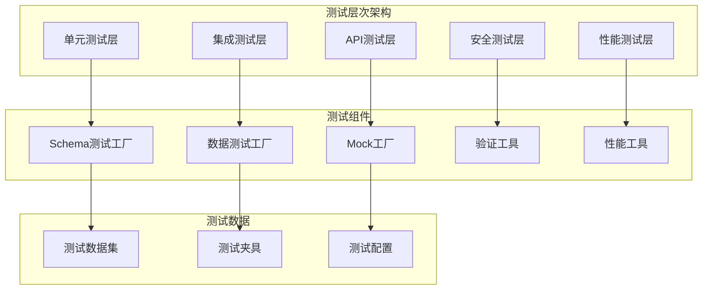

# 设计文档

## 概述

客户测试增强功能的设计旨在为对话式智能CRM系统的客户模块建立全面、系统化的测试框架。该设计基于现有的pytest测试基础设施，扩展测试覆盖范围，包括schema验证、数据完整性、业务规则、API接口、错误处理、性能、安全和集成测试等多个维度。

### 核心设计理念

1. **全面覆盖**: 确保客户模块的所有功能点都有相应的测试用例
2. **分层测试**: 从单元测试到集成测试的完整测试金字塔
3. **数据驱动**: 使用参数化测试和测试数据工厂模式
4. **可维护性**: 测试代码结构清晰，易于维护和扩展
5. **性能感知**: 包含性能基准测试，确保系统可扩展性

## 架构设计

### 测试架构层次



### 测试模块结构

```
tests/
├── test_schemas/
│   ├── test_customer_schema.py          # Schema验证测试
│   ├── test_customer_validation.py      # 数据验证测试
│   └── test_customer_serialization.py   # 序列化测试
├── test_models/
│   ├── test_customer_model.py           # 数据模型测试
│   └── test_customer_relationships.py   # 关系测试
├── test_services/
│   ├── test_customer_service.py         # 服务层测试（已存在，需扩展）
│   └── test_customer_business_rules.py  # 业务规则测试
├── test_api/
│   ├── test_customer_endpoints.py       # API端点测试
│   └── test_customer_integration.py     # API集成测试
├── test_performance/
│   ├── test_customer_performance.py     # 性能测试
│   └── test_customer_load.py           # 负载测试
├── test_security/
│   └── test_customer_security.py        # 安全测试
├── fixtures/
│   ├── customer_fixtures.py             # 客户测试夹具
│   └── database_fixtures.py            # 数据库测试夹具
└── factories/
    ├── customer_factory.py              # 客户数据工厂
    └── schema_factory.py               # Schema测试工厂
```

## 组件和接口设计

### 1. Schema测试组件

**CustomerSchemaValidator**

```python
from typing import Dict, Any, List, Optional
from pydantic import ValidationError
import pytest

class CustomerSchemaValidator:
    """客户Schema验证测试工具"""
    
    @staticmethod
    def validate_customer_create(data: Dict[str, Any]) -> ValidationError:
        """验证客户创建Schema"""
        from src.schemas.customer import CustomerCreate
        try:
            CustomerCreate(**data)
            return None
        except ValidationError as e:
            return e
    
    @staticmethod
    def validate_customer_update(data: Dict[str, Any]) -> ValidationError:
        """验证客户更新Schema"""
        from src.schemas.customer import CustomerUpdate
        try:
            CustomerUpdate(**data)
            return None
        except ValidationError as e:
            return e
    
    @staticmethod
    def validate_contact_info(data: Dict[str, Any]) -> ValidationError:
        """验证联系信息Schema"""
        from src.schemas.customer import ContactInfo
        try:
            ContactInfo(**data)
            return None
        except ValidationError as e:
            return e
    
    @staticmethod
    def validate_customer_profile(data: Dict[str, Any]) -> ValidationError:
        """验证客户画像Schema"""
        from src.schemas.customer import CustomerProfile
        try:
            CustomerProfile(**data)
            return None
        except ValidationError as e:
            return e

class SchemaTestCases:
    """Schema测试用例生成器"""
    
    @staticmethod
    def get_invalid_name_cases() -> List[Dict[str, Any]]:
        """获取无效姓名测试用例"""
        return [
            {"name": "", "company": "测试公司"},  # 空字符串
            {"name": "a" * 101, "company": "测试公司"},  # 超长字符串
            {"name": None, "company": "测试公司"},  # None值
            {"name": 123, "company": "测试公司"},  # 错误类型
        ]
    
    @staticmethod
    def get_invalid_company_cases() -> List[Dict[str, Any]]:
        """获取无效公司名测试用例"""
        return [
            {"name": "测试客户", "company": ""},  # 空字符串
            {"name": "测试客户", "company": "a" * 201},  # 超长字符串
            {"name": "测试客户", "company": None},  # None值
        ]
    
    @staticmethod
    def get_invalid_email_cases() -> List[Dict[str, Any]]:
        """获取无效邮箱测试用例"""
        return [
            {"email": "invalid-email"},  # 无效格式
            {"email": "@example.com"},  # 缺少用户名
            {"email": "user@"},  # 缺少域名
            {"email": "user@.com"},  # 无效域名
        ]
    
    @staticmethod
    def get_invalid_enum_cases() -> List[Dict[str, Any]]:
        """获取无效枚举测试用例"""
        return [
            {"status": "invalid_status"},  # 无效状态
            {"size": "invalid_size"},  # 无效规模
        ]
```

### 2. 数据工厂组件

**CustomerDataFactory**

```python
import factory
from factory import fuzzy
from datetime import datetime
from typing import Dict, Any, List
import uuid

from src.models.customer import Customer, CompanySize, CustomerStatus
from src.schemas.customer import CustomerCreate, CustomerUpdate, ContactInfo, CustomerProfile

class ContactInfoFactory(factory.Factory):
    """联系信息工厂"""
    class Meta:
        model = dict
    
    phone = fuzzy.FuzzyText(length=11, chars="0123456789")
    email = factory.LazyAttribute(lambda obj: f"test{uuid.uuid4().hex[:8]}@example.com")
    wechat = fuzzy.FuzzyText(length=10)
    address = "测试地址"
    website = "https://example.com"

class CustomerProfileFactory(factory.Factory):
    """客户画像工厂"""
    class Meta:
        model = dict
    
    decision_making_style = fuzzy.FuzzyChoice(["数据驱动", "直觉驱动", "协商驱动"])
    communication_preference = fuzzy.FuzzyChoice(["邮件", "电话", "微信", "面谈"])
    business_priorities = factory.LazyFunction(lambda: ["降本增效", "数字化转型"])
    pain_points = factory.LazyFunction(lambda: ["效率低下", "成本过高"])
    timeline = fuzzy.FuzzyChoice(["紧急", "3个月内", "6个月内", "1年内"])
    influencers = factory.LazyFunction(lambda: ["CEO", "CTO"])

class CustomerCreateFactory(factory.Factory):
    """客户创建数据工厂"""
    class Meta:
        model = dict
    
    name = factory.Sequence(lambda n: f"测试客户{n}")
    company = factory.Sequence(lambda n: f"测试公司{n}")
    industry = fuzzy.FuzzyChoice(["软件开发", "制造业", "金融", "教育", "医疗"])
    size = fuzzy.FuzzyChoice(list(CompanySize))
    contact = factory.SubFactory(ContactInfoFactory)
    profile = factory.SubFactory(CustomerProfileFactory)
    status = CustomerStatus.PROSPECT
    tags = factory.LazyFunction(lambda: ["测试", "重要"])
    notes = "这是一个测试客户"

class CustomerUpdateFactory(factory.Factory):
    """客户更新数据工厂"""
    class Meta:
        model = dict
    
    name = factory.Sequence(lambda n: f"更新客户{n}")
    industry = fuzzy.FuzzyChoice(["软件开发", "制造业"])
    contact = factory.SubFactory(ContactInfoFactory)

class CustomerTestDataGenerator:
    """客户测试数据生成器"""
    
    @staticmethod
    def create_valid_customer_data() -> Dict[str, Any]:
        """创建有效的客户数据"""
        return CustomerCreateFactory()
    
    @staticmethod
    def create_minimal_customer_data() -> Dict[str, Any]:
        """创建最小化客户数据"""
        return {
            "name": "最小客户",
            "company": "最小公司"
        }
    
    @staticmethod
    def create_complete_customer_data() -> Dict[str, Any]:
        """创建完整的客户数据"""
        return CustomerCreateFactory(
            contact=ContactInfoFactory(
                phone="13800138000",
                email="complete@example.com",
                wechat="complete_wechat",
                address="完整地址",
                website="https://complete.com"
            ),
            profile=CustomerProfileFactory(
                decision_making_style="数据驱动",
                communication_preference="邮件",
                business_priorities=["降本增效", "数字化转型", "提升效率"],
                pain_points=["成本过高", "效率低下", "流程复杂"],
                budget={"range": "100-500万", "approved": True},
                timeline="3个月内",
                influencers=["CEO", "CTO", "CFO"]
            ),
            custom_fields={
                "source": "官网",
                "priority": "高",
                "last_contact": "2024-01-01"
            }
        )
    
    @staticmethod
    def create_batch_customer_data(count: int) -> List[Dict[str, Any]]:
        """批量创建客户数据"""
        return [CustomerCreateFactory() for _ in range(count)]
```

### 3. 测试工具组件

**CustomerTestUtils**

```python
from typing import Dict, Any, List, Optional
from sqlalchemy.ext.asyncio import AsyncSession
import asyncio
import time
from contextlib import asynccontextmanager

class CustomerTestUtils:
    """客户测试工具类"""
    
    @staticmethod
    async def create_test_customer(db_session: AsyncSession, data: Dict[str, Any]) -> str:
        """创建测试客户并返回ID"""
        from src.services.customer_service import CustomerService
        from src.schemas.customer import CustomerCreate
        
        service = CustomerService(db_session)
        customer_data = CustomerCreate(**data)
        customer = await service.create_customer(customer_data)
        return str(customer.id)
    
    @staticmethod
    async def cleanup_test_customers(db_session: AsyncSession, customer_ids: List[str]):
        """清理测试客户数据"""
        from src.services.customer_service import CustomerService
        
        service = CustomerService(db_session)
        for customer_id in customer_ids:
            await service.delete_customer(customer_id)
    
    @staticmethod
    @asynccontextmanager
    async def customer_lifecycle(db_session: AsyncSession, data: Dict[str, Any]):
        """客户生命周期管理上下文"""
        customer_id = await CustomerTestUtils.create_test_customer(db_session, data)
        try:
            yield customer_id
        finally:
            await CustomerTestUtils.cleanup_test_customers(db_session, [customer_id])
    
    @staticmethod
    def measure_execution_time(func):
        """测量执行时间装饰器"""
        async def wrapper(*args, **kwargs):
            start_time = time.time()
            result = await func(*args, **kwargs)
            end_time = time.time()
            execution_time = end_time - start_time
            return result, execution_time
        return wrapper
    
    @staticmethod
    async def assert_customer_equals(actual: Dict[str, Any], expected: Dict[str, Any], ignore_fields: List[str] = None):
        """断言客户数据相等"""
        ignore_fields = ignore_fields or ['id', 'created_at', 'updated_at']
        
        for key, value in expected.items():
            if key not in ignore_fields:
                assert key in actual, f"Missing field: {key}"
                if isinstance(value, dict):
                    await CustomerTestUtils.assert_customer_equals(actual[key], value, ignore_fields)
                elif isinstance(value, list):
                    assert set(actual[key]) == set(value), f"List mismatch for {key}"
                else:
                    assert actual[key] == value, f"Value mismatch for {key}: {actual[key]} != {value}"

class PerformanceTestUtils:
    """性能测试工具类"""
    
    @staticmethod
    async def measure_concurrent_operations(operations: List, max_concurrent: int = 10):
        """测量并发操作性能"""
        semaphore = asyncio.Semaphore(max_concurrent)
        
        async def limited_operation(operation):
            async with semaphore:
                start_time = time.time()
                result = await operation()
                end_time = time.time()
                return result, end_time - start_time
        
        start_total = time.time()
        results = await asyncio.gather(*[limited_operation(op) for op in operations])
        end_total = time.time()
        
        execution_times = [result[1] for result in results]
        return {
            'total_time': end_total - start_total,
            'avg_time': sum(execution_times) / len(execution_times),
            'max_time': max(execution_times),
            'min_time': min(execution_times),
            'results': [result[0] for result in results]
        }
    
    @staticmethod
    def assert_performance_threshold(execution_time: float, threshold: float, operation_name: str):
        """断言性能阈值"""
        assert execution_time <= threshold, f"{operation_name} took {execution_time:.2f}s, exceeding threshold of {threshold}s"
```

### 4. API测试组件

**CustomerAPITestClient**

```python
from httpx import AsyncClient
from typing import Dict, Any, Optional
import json

class CustomerAPITestClient:
    """客户API测试客户端"""
    
    def __init__(self, client: AsyncClient, base_url: str = "/api/v1/customers"):
        self.client = client
        self.base_url = base_url
    
    async def create_customer(self, data: Dict[str, Any]) -> Dict[str, Any]:
        """创建客户"""
        response = await self.client.post(self.base_url, json=data)
        return {
            'status_code': response.status_code,
            'data': response.json() if response.status_code < 400 else None,
            'error': response.json() if response.status_code >= 400 else None
        }
    
    async def get_customer(self, customer_id: str) -> Dict[str, Any]:
        """获取客户"""
        response = await self.client.get(f"{self.base_url}/{customer_id}")
        return {
            'status_code': response.status_code,
            'data': response.json() if response.status_code < 400 else None,
            'error': response.json() if response.status_code >= 400 else None
        }
    
    async def update_customer(self, customer_id: str, data: Dict[str, Any]) -> Dict[str, Any]:
        """更新客户"""
        response = await self.client.put(f"{self.base_url}/{customer_id}", json=data)
        return {
            'status_code': response.status_code,
            'data': response.json() if response.status_code < 400 else None,
            'error': response.json() if response.status_code >= 400 else None
        }
    
    async def delete_customer(self, customer_id: str) -> Dict[str, Any]:
        """删除客户"""
        response = await self.client.delete(f"{self.base_url}/{customer_id}")
        return {
            'status_code': response.status_code,
            'data': response.json() if response.status_code < 400 else None,
            'error': response.json() if response.status_code >= 400 else None
        }
    
    async def list_customers(self, params: Optional[Dict[str, Any]] = None) -> Dict[str, Any]:
        """获取客户列表"""
        response = await self.client.get(self.base_url, params=params)
        return {
            'status_code': response.status_code,
            'data': response.json() if response.status_code < 400 else None,
            'error': response.json() if response.status_code >= 400 else None
        }
    
    async def search_customers(self, query: str) -> Dict[str, Any]:
        """搜索客户"""
        response = await self.client.get(f"{self.base_url}/search", params={"q": query})
        return {
            'status_code': response.status_code,
            'data': response.json() if response.status_code < 400 else None,
            'error': response.json() if response.status_code >= 400 else None
        }
```

## 数据模型设计

### 测试数据模型

```python
from pydantic import BaseModel
from typing import List, Dict, Any, Optional
from datetime import datetime

class TestResult(BaseModel):
    """测试结果模型"""
    test_name: str
    status: str  # "passed", "failed", "skipped"
    execution_time: float
    error_message: Optional[str] = None
    details: Dict[str, Any] = {}

class PerformanceMetrics(BaseModel):
    """性能指标模型"""
    operation_name: str
    total_time: float
    avg_time: float
    max_time: float
    min_time: float
    throughput: float  # operations per second
    success_rate: float

class ValidationTestCase(BaseModel):
    """验证测试用例模型"""
    name: str
    input_data: Dict[str, Any]
    expected_valid: bool
    expected_errors: List[str] = []
    description: str

class APITestCase(BaseModel):
    """API测试用例模型"""
    name: str
    method: str
    endpoint: str
    payload: Optional[Dict[str, Any]] = None
    expected_status: int
    expected_response_fields: List[str] = []
    description: str
```

## 错误处理设计

### 测试错误分类

```python
class TestError(Exception):
    """测试基础错误类"""
    pass

class SchemaValidationTestError(TestError):
    """Schema验证测试错误"""
    pass

class DataIntegrityTestError(TestError):
    """数据完整性测试错误"""
    pass

class PerformanceTestError(TestError):
    """性能测试错误"""
    pass

class APITestError(TestError):
    """API测试错误"""
    pass

class TestErrorHandler:
    """测试错误处理器"""
    
    @staticmethod
    def handle_validation_error(error: Exception, test_context: Dict[str, Any]) -> TestResult:
        """处理验证错误"""
        return TestResult(
            test_name=test_context.get('test_name', 'unknown'),
            status='failed',
            execution_time=0.0,
            error_message=str(error),
            details=test_context
        )
    
    @staticmethod
    def handle_performance_error(error: Exception, metrics: PerformanceMetrics) -> TestResult:
        """处理性能测试错误"""
        return TestResult(
            test_name=metrics.operation_name,
            status='failed',
            execution_time=metrics.total_time,
            error_message=str(error),
            details=metrics.dict()
        )
```

## 测试策略

### 1. 单元测试策略

- **Schema验证测试**: 使用参数化测试覆盖所有验证规则
- **数据模型测试**: 测试ORM映射和数据库约束
- **服务层测试**: 测试业务逻辑和数据处理

### 2. 集成测试策略

- **数据库集成**: 测试数据持久化和查询
- **服务集成**: 测试服务间的协作
- **API集成**: 测试端到端的API调用

### 3. 性能测试策略

- **基准测试**: 建立性能基线
- **负载测试**: 测试系统在高负载下的表现
- **并发测试**: 测试并发操作的正确性

### 4. 安全测试策略

- **输入验证**: 测试恶意输入的处理
- **权限控制**: 测试访问控制机制
- **数据保护**: 测试敏感数据的保护

这个设计文档提供了全面的客户测试增强功能的技术架构和实现方案，涵盖了从测试组件设计到测试策略的各个方面。