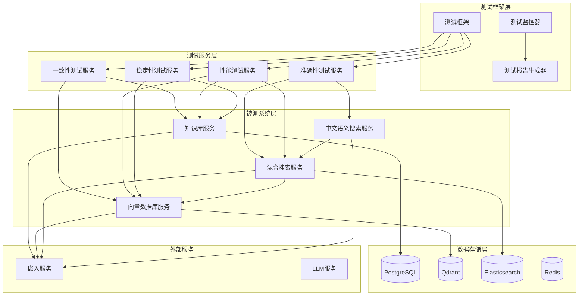
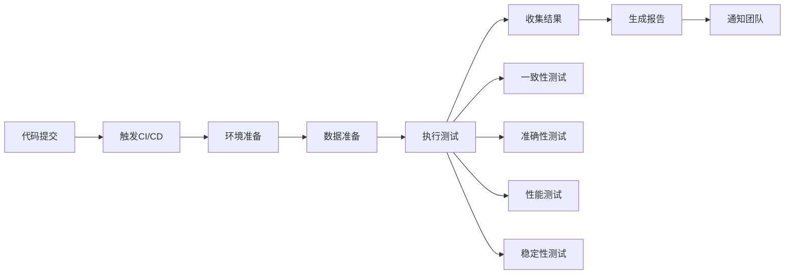

# 设计文档

## 概述

本设计文档描述了知识库与向量数据库联合测试系统的架构和实现方案。该系统将对已实现的知识管理服务(KnowledgeService)、向量数据库服务(VectorService)、混合搜索服务(HybridSearchService)和中文语义搜索服务(ChineseSemanticSearchService)进行全面的集成测试，确保各组件协同工作的稳定性和准确性。

## 架构

### 系统架构图



### 核心组件

1. **测试框架层**
   - 测试执行引擎
   - 测试数据管理
   - 测试结果收集
   - 测试报告生成

2. **测试服务层**
   - 数据一致性测试服务
   - 搜索准确性测试服务
   - 性能基准测试服务
   - 系统稳定性测试服务

3. **被测系统层**
   - 知识库管理服务
   - 向量数据库服务
   - 混合搜索服务
   - 中文语义搜索服务

## 组件和接口

### 1. 测试框架核心 (TestFramework)

```python
class TestFramework:
    """测试框架核心类"""
    
    async def initialize(self) -> None:
        """初始化测试环境"""
        
    async def run_test_suite(self, suite_name: str) -> TestResult:
        """运行测试套件"""
        
    async def cleanup(self) -> None:
        """清理测试环境"""
```

### 2. 数据一致性测试服务 (ConsistencyTestService)

```python
class ConsistencyTestService:
    """数据一致性测试服务"""
    
    async def test_knowledge_vector_sync(self) -> ConsistencyTestResult:
        """测试知识库与向量库同步一致性"""
        
    async def test_crud_operations_consistency(self) -> ConsistencyTestResult:
        """测试CRUD操作的数据一致性"""
        
    async def test_batch_operations_consistency(self) -> ConsistencyTestResult:
        """测试批量操作的数据一致性"""
```

### 3. 搜索准确性测试服务 (AccuracyTestService)

```python
class AccuracyTestService:
    """搜索准确性测试服务"""
    
    async def test_semantic_search_accuracy(self) -> AccuracyTestResult:
        """测试语义搜索准确性"""
        
    async def test_hybrid_search_effectiveness(self) -> AccuracyTestResult:
        """测试混合搜索有效性"""
        
    async def test_chinese_search_quality(self) -> AccuracyTestResult:
        """测试中文搜索质量"""
```

### 4. 性能测试服务 (PerformanceTestService)

```python
class PerformanceTestService:
    """性能测试服务"""
    
    async def test_search_response_time(self) -> PerformanceTestResult:
        """测试搜索响应时间"""
        
    async def test_concurrent_search_performance(self) -> PerformanceTestResult:
        """测试并发搜索性能"""
        
    async def test_batch_import_performance(self) -> PerformanceTestResult:
        """测试批量导入性能"""
```

### 5. 稳定性测试服务 (StabilityTestService)

```python
class StabilityTestService:
    """稳定性测试服务"""
    
    async def test_system_health_monitoring(self) -> StabilityTestResult:
        """测试系统健康监控"""
        
    async def test_error_handling_robustness(self) -> StabilityTestResult:
        """测试错误处理鲁棒性"""
        
    async def test_long_running_stability(self) -> StabilityTestResult:
        """测试长时间运行稳定性"""
```

## 数据模型

### 测试结果数据模型

```python
@dataclass
class TestResult:
    """测试结果基类"""
    test_id: str
    test_name: str
    status: TestStatus
    start_time: datetime
    end_time: datetime
    duration: float
    success_count: int
    failure_count: int
    error_messages: List[str]
    metrics: Dict[str, Any]

@dataclass
class ConsistencyTestResult(TestResult):
    """一致性测试结果"""
    sync_accuracy: float
    data_integrity_score: float
    inconsistency_details: List[Dict[str, Any]]

@dataclass
class AccuracyTestResult(TestResult):
    """准确性测试结果"""
    precision: float
    recall: float
    f1_score: float
    relevance_score: float
    test_cases: List[Dict[str, Any]]

@dataclass
class PerformanceTestResult(TestResult):
    """性能测试结果"""
    avg_response_time: float
    max_response_time: float
    min_response_time: float
    throughput: float
    resource_usage: Dict[str, float]

@dataclass
class StabilityTestResult(TestResult):
    """稳定性测试结果"""
    uptime_percentage: float
    error_rate: float
    recovery_time: float
    health_score: float
```

### 测试数据模型

```python
@dataclass
class TestDocument:
    """测试文档"""
    id: str
    title: str
    content: str
    category: str
    tags: List[str]
    expected_keywords: List[str]
    language: str = "zh"

@dataclass
class TestQuery:
    """测试查询"""
    id: str
    query_text: str
    expected_results: List[str]
    relevance_scores: Dict[str, float]
    query_type: str
    difficulty_level: int
```

## 错误处理

### 错误分类

1. **系统级错误**
   - 服务连接失败
   - 数据库连接异常
   - 内存不足
   - 网络超时

2. **数据级错误**
   - 数据不一致
   - 向量维度不匹配
   - 编码错误
   - 数据损坏

3. **业务级错误**
   - 搜索结果不准确
   - 响应时间超标
   - 并发处理失败
   - 功能逻辑错误

### 错误处理策略

```python
class TestErrorHandler:
    """测试错误处理器"""
    
    async def handle_system_error(self, error: SystemError) -> ErrorHandlingResult:
        """处理系统级错误"""
        
    async def handle_data_error(self, error: DataError) -> ErrorHandlingResult:
        """处理数据级错误"""
        
    async def handle_business_error(self, error: BusinessError) -> ErrorHandlingResult:
        """处理业务级错误"""
        
    async def generate_error_report(self, errors: List[TestError]) -> ErrorReport:
        """生成错误报告"""
```

## 测试策略

### 1. 数据一致性测试策略

- **同步测试**: 验证知识库和向量库的数据同步
- **事务测试**: 验证跨系统事务的一致性
- **恢复测试**: 验证系统故障后的数据恢复能力

### 2. 搜索准确性测试策略

- **基准测试**: 使用标准数据集进行准确性评估
- **对比测试**: 比较不同搜索模式的效果
- **边界测试**: 测试极端情况下的搜索表现

### 3. 性能测试策略

- **负载测试**: 模拟正常负载下的性能表现
- **压力测试**: 测试系统在高负载下的表现
- **容量测试**: 确定系统的最大处理能力

### 4. 稳定性测试策略

- **长时间运行测试**: 验证系统长期稳定性
- **故障注入测试**: 模拟各种故障场景
- **恢复测试**: 验证系统的自动恢复能力

## 测试数据管理

### 测试数据集设计

1. **中文知识库数据集**
   - 技术文档 (1000篇)
   - 业务流程文档 (500篇)
   - FAQ文档 (300篇)
   - 产品说明文档 (200篇)

2. **测试查询集**
   - 简单查询 (100个)
   - 复杂查询 (50个)
   - 模糊查询 (30个)
   - 多语言查询 (20个)

3. **基准答案集**
   - 每个查询的期望结果
   - 相关性评分标准
   - 准确性评估标准

### 数据生成和管理

```python
class TestDataManager:
    """测试数据管理器"""
    
    async def generate_test_documents(self, count: int) -> List[TestDocument]:
        """生成测试文档"""
        
    async def generate_test_queries(self, count: int) -> List[TestQuery]:
        """生成测试查询"""
        
    async def load_benchmark_dataset(self, dataset_name: str) -> TestDataset:
        """加载基准数据集"""
        
    async def cleanup_test_data(self) -> None:
        """清理测试数据"""
```

## 监控和报告

### 实时监控

- **系统资源监控**: CPU、内存、磁盘、网络使用情况
- **服务状态监控**: 各服务的健康状态和响应时间
- **数据质量监控**: 数据一致性和完整性指标
- **性能指标监控**: 搜索响应时间、吞吐量等

### 测试报告

```python
class TestReportGenerator:
    """测试报告生成器"""
    
    async def generate_summary_report(self, results: List[TestResult]) -> SummaryReport:
        """生成测试摘要报告"""
        
    async def generate_detailed_report(self, results: List[TestResult]) -> DetailedReport:
        """生成详细测试报告"""
        
    async def generate_performance_report(self, results: List[PerformanceTestResult]) -> PerformanceReport:
        """生成性能测试报告"""
        
    async def export_report(self, report: TestReport, format: str) -> str:
        """导出测试报告"""
```

### 报告内容

1. **执行摘要**
   - 测试概况
   - 主要发现
   - 建议和改进点

2. **详细结果**
   - 各测试用例的详细结果
   - 错误分析和根因
   - 性能指标趋势

3. **可视化图表**
   - 性能趋势图
   - 准确性对比图
   - 错误分布图
   - 系统资源使用图

## 自动化和CI/CD集成

### 自动化测试流程



### CI/CD集成配置

```yaml
# .github/workflows/knowledge-vector-test.yml
name: Knowledge Vector Testing

on:
  push:
    branches: [main, develop]
  pull_request:
    branches: [main]
  schedule:
    - cron: '0 2 * * *'  # 每日凌晨2点执行

jobs:
  knowledge-vector-test:
    runs-on: ubuntu-latest
    
    services:
      postgres:
        image: postgres:13
        env:
          POSTGRES_PASSWORD: postgres
        options: >-
          --health-cmd pg_isready
          --health-interval 10s
          --health-timeout 5s
          --health-retries 5
      
      qdrant:
        image: qdrant/qdrant:latest
        ports:
          - 6333:6333
          - 6334:6334
      
      elasticsearch:
        image: elasticsearch:8.8.0
        env:
          discovery.type: single-node
          xpack.security.enabled: false
        ports:
          - 9200:9200
    
    steps:
      - uses: actions/checkout@v3
      
      - name: Set up Python
        uses: actions/setup-python@v4
        with:
          python-version: '3.11'
      
      - name: Install dependencies
        run: |
          pip install -r requirements.txt
          pip install pytest pytest-asyncio pytest-cov
      
      - name: Wait for services
        run: |
          sleep 30
      
      - name: Run knowledge vector tests
        run: |
          python -m pytest tests/test_knowledge_vector_integration.py -v --cov=src
      
      - name: Generate test report
        run: |
          python scripts/generate_test_report.py
      
      - name: Upload test results
        uses: actions/upload-artifact@v3
        with:
          name: test-results
          path: test-results/
```

## 扩展性设计

### 插件化架构

系统采用插件化设计，支持：

1. **自定义测试插件**: 允许添加特定业务场景的测试
2. **数据源插件**: 支持不同类型的测试数据源
3. **报告插件**: 支持不同格式的测试报告
4. **监控插件**: 支持不同的监控系统集成

### 配置管理

```python
@dataclass
class TestConfiguration:
    """测试配置"""
    test_environment: str
    database_configs: Dict[str, Any]
    service_endpoints: Dict[str, str]
    test_data_paths: Dict[str, str]
    performance_thresholds: Dict[str, float]
    notification_settings: Dict[str, Any]
```

这个设计确保了测试系统的全面性、可扩展性和可维护性，能够有效验证知识库与向量数据库的联合工作能力。