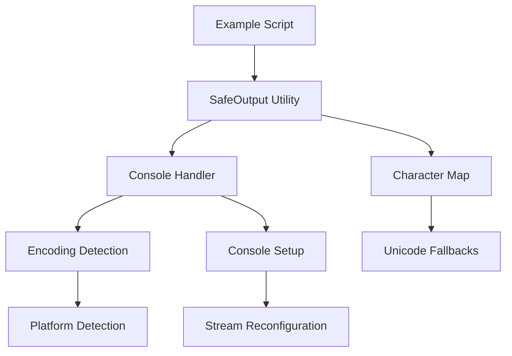

# Design Document

## Overview

The Unicode encoding fix addresses the `UnicodeEncodeError` that occurs when running example scripts on Windows systems with GBK console encoding. The solution provides a robust, cross-platform approach to handle Unicode characters gracefully while maintaining the visual appeal and functionality of the example scripts.

The design implements a multi-layered approach:
1. **Console encoding detection and setup** - Automatically detect and configure appropriate console encoding
2. **Unicode-safe output utility** - Provide a centralized utility for safe Unicode character output
3. **Fallback character mapping** - Define ASCII alternatives for common Unicode symbols
4. **Backwards compatibility** - Ensure existing functionality remains intact

## Architecture

### Core Components

```
unicode_utils/
├── console_handler.py     # Console encoding detection and setup
├── safe_output.py         # Unicode-safe output utilities  
├── character_map.py       # Unicode to ASCII character mappings
└── __init__.py           # Public API exports
```

### Component Interactions



## Components and Interfaces

### 1. Console Handler (`console_handler.py`)

**Purpose**: Detect console encoding capabilities and configure appropriate output streams.

**Key Functions**:
- `detect_console_encoding()` - Detect current console encoding
- `setup_unicode_console()` - Configure console for Unicode output when possible
- `is_unicode_supported()` - Check if console supports Unicode characters

**Interface**:
```python
class ConsoleHandler:
    @staticmethod
    def detect_console_encoding() -> str
    
    @staticmethod
    def setup_unicode_console() -> bool
    
    @staticmethod
    def is_unicode_supported() -> bool
    
    @staticmethod
    def get_safe_encoding() -> str
```

### 2. Safe Output Utility (`safe_output.py`)

**Purpose**: Provide Unicode-safe printing and output functions with automatic fallback.

**Key Functions**:
- `safe_print()` - Unicode-safe print function with fallback
- `format_status()` - Format status messages with appropriate symbols
- `format_progress()` - Format progress indicators safely

**Interface**:
```python
class SafeOutput:
    def __init__(self, enable_unicode: bool = None)
    
    def safe_print(self, *args, **kwargs) -> None
    
    def format_status(self, status: str, message: str) -> str
    
    def format_progress(self, current: int, total: int, prefix: str = "") -> str
    
    def format_section(self, title: str, level: int = 1) -> str
```

### 3. Character Map (`character_map.py`)

**Purpose**: Define mappings between Unicode symbols and ASCII alternatives.

**Key Features**:
- Comprehensive emoji-to-ASCII mapping
- Context-aware symbol selection
- Extensible mapping system

**Interface**:
```python
class CharacterMap:
    # Status symbols
    SUCCESS_SYMBOLS = {"unicode": "✅", "ascii": "[OK]"}
    ERROR_SYMBOLS = {"unicode": "❌", "ascii": "[ERROR]"}
    WARNING_SYMBOLS = {"unicode": "⚠️", "ascii": "[WARN]"}
    
    # Progress symbols  
    LIGHTNING_SYMBOLS = {"unicode": "⚡", "ascii": "[FAST]"}
    SEARCH_SYMBOLS = {"unicode": "🔍", "ascii": "[SEARCH]"}
    
    @staticmethod
    def get_symbol(symbol_name: str, use_unicode: bool = True) -> str
    
    @staticmethod
    def replace_unicode_in_text(text: str, use_unicode: bool = True) -> str
```

## Data Models

### Configuration Model

```python
@dataclass
class UnicodeConfig:
    enable_unicode: bool = True
    console_encoding: str = "utf-8"
    fallback_encoding: str = "ascii"
    auto_detect: bool = True
    force_ascii: bool = False
```

### Symbol Mapping Model

```python
@dataclass
class SymbolMapping:
    unicode_char: str
    ascii_fallback: str
    description: str
    category: str  # 'status', 'progress', 'decoration'
```

## Error Handling

### Encoding Detection Failures
- **Scenario**: Cannot detect console encoding
- **Handling**: Default to ASCII mode with logging
- **Fallback**: Use most conservative ASCII-only output

### Unicode Output Failures
- **Scenario**: Unicode character fails to output even after setup
- **Handling**: Catch `UnicodeEncodeError` and retry with ASCII fallback
- **Recovery**: Log the failure and continue with ASCII alternatives

### Platform-Specific Issues
- **Scenario**: Platform-specific encoding issues
- **Handling**: Platform detection with specific workarounds
- **Examples**: Windows GBK, Linux locale issues, macOS terminal variations

### Error Recovery Strategy

```python
def safe_unicode_output(text: str) -> str:
    try:
        # Try Unicode output
        return text
    except UnicodeEncodeError:
        # Fall back to ASCII
        return CharacterMap.replace_unicode_in_text(text, use_unicode=False)
    except Exception as e:
        # Ultimate fallback
        logger.warning(f"Output encoding failed: {e}")
        return text.encode('ascii', errors='replace').decode('ascii')
```

## Testing Strategy

### Unit Tests

1. **Console Handler Tests**
   - Test encoding detection on different platforms
   - Test console setup success/failure scenarios
   - Test Unicode support detection accuracy

2. **Safe Output Tests**
   - Test Unicode output with various encodings
   - Test fallback behavior when Unicode fails
   - Test formatting functions with different symbol sets

3. **Character Map Tests**
   - Test symbol mapping completeness
   - Test text replacement accuracy
   - Test extensibility of mapping system

### Integration Tests

1. **Cross-Platform Tests**
   - Test on Windows with GBK encoding
   - Test on Linux with various locales
   - Test on macOS with different terminal configurations

2. **Example Script Tests**
   - Test all example scripts with Unicode fix applied
   - Verify functionality preservation
   - Test output readability in both Unicode and ASCII modes

### Performance Tests

1. **Output Performance**
   - Measure overhead of encoding detection
   - Test performance impact of character replacement
   - Benchmark against original implementation

2. **Memory Usage**
   - Test memory usage of character mapping
   - Verify no memory leaks in encoding setup

### Compatibility Tests

1. **Backwards Compatibility**
   - Ensure existing scripts work without modification
   - Test with various Python versions (3.8+)
   - Verify no breaking changes to existing APIs

2. **Environment Compatibility**
   - Test in Docker containers
   - Test with various IDE terminals
   - Test with CI/CD environments