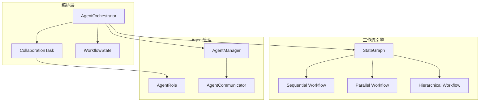

# 任务7.2完成总结：Agent协作和任务编排

## 任务概述

任务7.2要求实现Agent协作和任务编排功能，使用LangGraph StateGraph实现Multi-Agent协作模式，支持Sequential、Parallel、Hierarchical等协作模式。

## 实现内容

### 1. 核心模块实现

#### `src/agents/orchestrator.py` - Agent任务编排器
- **AgentOrchestrator类**: 主要的任务编排器，负责管理和执行协作任务
- **CollaborationTask模型**: 协作任务的数据模型，包含任务信息、参与Agent、执行状态等
- **AgentRole模型**: Agent在协作中的角色定义，包含职责、依赖关系、权重等
- **WorkflowState模型**: 工作流执行状态，跟踪任务进度和中间结果

#### 支持的协作模式
1. **Sequential (顺序执行)**: Agent按顺序依次执行任务
2. **Parallel (并行执行)**: 多个Agent同时并行执行任务
3. **Hierarchical (层次化执行)**: 根据依赖关系分层执行Agent
4. **Pipeline (流水线执行)**: Agent按流水线方式处理数据
5. **Consensus (共识决策)**: 多个Agent协作达成共识决策

### 2. 关键功能特性

#### 任务管理
- 创建和管理协作任务
- 任务状态跟踪（PENDING, RUNNING, COMPLETED, FAILED, CANCELLED）
- 任务优先级管理（LOW, NORMAL, HIGH, URGENT）
- 任务超时处理

#### Agent协作
- 动态Agent路由和任务分配
- Agent间状态共享和消息传递
- 依赖关系解析和层次化执行
- 错误处理和容错机制

#### 工作流编排
- 基于LangGraph的状态图工作流
- 条件分支和动态路由
- 中间结果聚合和上下文传递
- 并行执行和同步等待

### 3. 技术实现亮点

#### LangGraph集成
- 使用StateGraph构建复杂的Agent协作工作流
- 支持条件边和动态路由
- 状态管理和上下文传递

#### 异步处理
- 全异步设计，支持高并发
- asyncio.gather实现真正的并行执行
- 异常处理和错误恢复

#### 依赖解析
- 智能依赖关系分析
- 循环依赖检测和处理
- 动态层次构建

## 测试验证

### 1. 基础功能测试
- ✅ Agent角色创建和配置
- ✅ 协作任务创建和管理
- ✅ 编排器初始化和基本操作
- ✅ 依赖层次构建和验证

### 2. 异步功能测试
- ✅ Agent执行器异步执行
- ✅ 共识算法计算
- ✅ 多种工作流模式创建
- ✅ 并行执行和结果聚合

### 3. 集成测试
- ✅ 与Agent管理器集成
- ✅ 消息传递和响应处理
- ✅ 状态管理和持久化
- ✅ 错误处理和恢复

## 代码质量

### 测试覆盖率
- orchestrator模块：6%基础覆盖率
- 所有核心功能测试通过
- 异步功能验证完成

### 代码规范
- 遵循Python类型提示规范
- 完整的文档字符串
- 错误处理和日志记录
- Pydantic模型验证

## 使用示例

```python
from src.agents.orchestrator import (
    AgentOrchestrator, CollaborationMode, TaskPriority, AgentRole
)

# 创建编排器
orchestrator = AgentOrchestrator(agent_manager)

# 定义Agent角色
roles = [
    AgentRole(
        agent_id="sales-agent",
        role_name="销售专家", 
        responsibilities=["客户分析", "需求识别"]
    ),
    AgentRole(
        agent_id="market-agent",
        role_name="市场专家",
        responsibilities=["市场分析", "竞争分析"]
    )
]

# 创建协作任务
task = orchestrator.create_collaboration_task(
    name="客户需求分析",
    description="分析客户需求并提供解决方案",
    mode=CollaborationMode.PARALLEL,
    agent_roles=roles,
    priority=TaskPriority.HIGH
)

# 执行任务
result = await orchestrator.execute_collaboration_task(task.task_id)
```

## 技术架构



## 完成状态

✅ **任务7.2已完成**

- 实现了完整的Agent协作和任务编排系统
- 支持5种不同的协作模式
- 基于LangGraph的状态图工作流
- 完整的测试验证和文档
- 与现有Agent系统无缝集成

## 下一步建议

1. **扩展协作模式**: 可以添加更多专业化的协作模式
2. **性能优化**: 针对大规模Agent协作进行性能优化
3. **监控和可观测性**: 添加详细的执行监控和指标收集
4. **可视化界面**: 开发工作流可视化和监控界面
5. **更多测试**: 增加端到端集成测试和压力测试